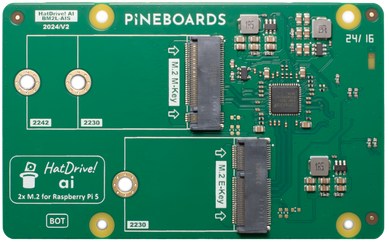

# Installing Frigate on Raspberry Pi 5 with a Google Coral TPU

**Date of this tutorial: 18.04.2025**

Frigate is a versatile Network Video Recorder that is quick and easy to get up and running thanks to its ready to go Docker images and simple user interface. 

You can use it to monitor, record, and perform object detection (with suitable hardware, we’ll get to that a little later) on your various camera feeds so you can keep an eye on your home, office, or anywhere you may need to watch! 

# Preface

## Who is this tutorial for?

* Pineboards sell the boards and AI Kit but their complete website and all documentation has disappeared. You need access to the respective documents.
* Kernel version 6.6.30 or higher is needed for the Pineboards Hat Ai overlay. Your installation is beyond this point and you run into problems installing the **gasket drivers** with the newer Kernel versions being installed in Debian Bookworm. My version is currently:

> Linux frigate 6.12.22-v8+ #1872 SMP PREEMPT Tue Apr 15 15:46:58 BST 2025 aarch64 GNU/Linux

**Please read the entire document before you start.**

## What you need
* You’ll need a Raspberry Pi 5. 
* NVME SSD mounted on the HatDrive! AI
* An internet connection.
* Basic knowledge of terminal commands.

My example uses the Pineboards HatDrive! Ai attached to the Pi 5: 
* M.2 NVMe (2230 and 2242) + 
* M.2 E-Key for the Coral Edge TPU. 
* Supports Gen 2 PCIe speeds.

Assembly instructions for the board can be found here: <a href="https://y.hs58.de/4e22r" target="_blank" rel="noreferrer noopener">HatDrive! Ai</a>

## Drivers
* No drivers are required for NVMe SSDs on the Raspberry Pi 5. 
* Google Coral Edge TPU needs the Gasket kernel driver.

# Installing

1. Follow this instruction:  <a href="https://y.hs58.de/ef06n" target="_blank" rel="noreferrer noopener">Installing Frigate on Raspberry Pi 5 with a Google Coral TPU</a> 
    >I recommend not to use the mentioned microSD card, but use a NVME SSD instead. How to flash your operating system to the NVME SSD is perfectly described here:  <a href="https://y.hs58.de/y0hvz" target="_blank" rel="noreferrer noopener">How to flash an NVMe boot drive with Raspberry Pi 5</a>
2. When above document comes to **Installing the Necessary Drivers for the Coral TPU** follow this steps:  
<a href="https://y.hs58.de/uszf4" target="_blank" rel="noreferrer noopener">How to configure the Google Coral Edge TPU on the Raspberry Pi 5</a>

    **Errors I faced:** 
   **Step 3: Import the repository GPG key:**

    `curl https://packages.cloud.google.com/apt/doc/apt-key.gpg | sudo apt-key add`

    ended up with an error

    >Warning: apt-key is deprecated. Manage keyring files in trusted.gpg.d instead (see apt-key(8)).

    This can be avoided by 

    `curl -fsSL https://packages.cloud.google.com/apt/doc/apt-key.gpg | gpg --dearmor | sudo tee /etc/apt/trusted.gpg.d/google.gpg > /dev/null
    `

    **Step 4: Install the Gasket Driver**

    `sudo dpkg -i gasket-dkms_1.0-18_all.deb`

    ended up in 
    >Deprecated feature: REMAKE_INITRD (/var/lib/dkms/gasket/1.0/source/dkms.conf) 
    >Error! Bad return status for module build on kernel: 6.12.22-v8+ (aarch64)

    The error does not occur during unpacking, but during the build - more precisely in the DKMS build process. You need to check 

    `/var/lib/dkms/gasket/1.0/build/make.log`

    Log shows a failure:

    >/var/lib/dkms/gasket/1.0/build/gasket_page_table.o 
    >/var/lib/dkms/gasket/1.0/build/gasket_core.c:1376:19: error: 'no_llseek' undeclared here (not in a function); did you mean 'noop_llseek'? 
    >1376 |         .llseek = no_llseek, 
    >     |                   ^~~~~~~~~ 
    >     |                   noop_llseek 
    >make[2]: *** [scripts/Makefile.build:244: 
    >/var/lib/dkms/gasket/1.0/build/gasket_core.o] Fehler 1

    **What is the problem?** 
    The gasket driver uses the old kernel function no_llseek, which has been removed in newer kernel versions. Since kernel 6.6+, no_llseek is no longer available. Instead, noop_llseek should be used.

    You have kernel > 6.6+ (as in this example I have 6.12.22-v8+), so no_llseek is no longer defined here ⇒ Build aborts.

    **Solution: Patch source code (1-line fix)** 
    We change the driver source code so that noop_llseek is used instead of no_llseek. 
    `sudo nano /var/lib/dkms/gasket/1.0/source/gasket_core.c`
    
    Search for  
    `.llseek = no_llseek,` 
    and change to  
    `.llseek = noop_llseek,` 
    Save & Close file. 

    **Rebuild module** 
    Then rebuild the module: 
    `sudo dkms build -m gasket -v 1.0` 
    If this runs successfully, then install: 
    `sudo dkms install -m gasket -v 1.0`

    Then test. If everything runs smoothly, you can check whether the module can be loaded: 
    `sudo modprobe gasket` 
    If you also need the Coral driver (as we do for our PCIe TPU): 
    `sudo modprobe apex` 
    Now install with the new built gasket driver: 
    ``sudo dpkg -i gasket-dkms_1.0-18_all.deb``  
3. Carry on with Step 5 and following.  
4. Return back to  <a href="https://y.hs58.de/ef06n" target="_blank" rel="noreferrer noopener">Installing Frigate on Raspberry Pi 5 with a Google Coral TPU</a>

# Supporting files:
In this repository I attached 3 examples:

* Docker compose.yaml
* Frigate config.yml
* A patch script that supports in rebuilding the gasket module: build_patched_gasket_with_debuild.sh

# Sources
* Pineboards in WayBack machine:
  * <a href="https://y.hs58.de/4e22r" target="_blank" rel="noreferrer noopener">HatDrive! Ai</a>
  * <a href="https://y.hs58.de/y0hvz" target="_blank" rel="noreferrer noopener">How to flash an NVMe boot drive with Raspberry Pi 5</a>
  * <a href="https://y.hs58.de/1edk5" target="_blank" rel="noreferrer noopener">How to update your Raspberry Pi Kernel and install Kernel Headers</a>
  * <a href="https://y.hs58.de/ef06n" target="_blank" rel="noreferrer noopener">Installing Frigate on Raspberry Pi 5 with a Google Coral TPU</a>
  * <a href="https://y.hs58.de/uszf4" target="_blank" rel="noreferrer noopener">How to configure the Google Coral Edge TPU on the Raspberry Pi 5</a>
  
* <a href="https://y.hs58.de/xaflc" target="_blank" rel="noreferrer noopener">Frigate Documentation</a>
* Heise+:: <a href="https://y.hs58.de/a6ke9" target="_blank" rel="noreferrer noopener">Videoaufnahmen auswerten mit Raspi und Frigate </a>
